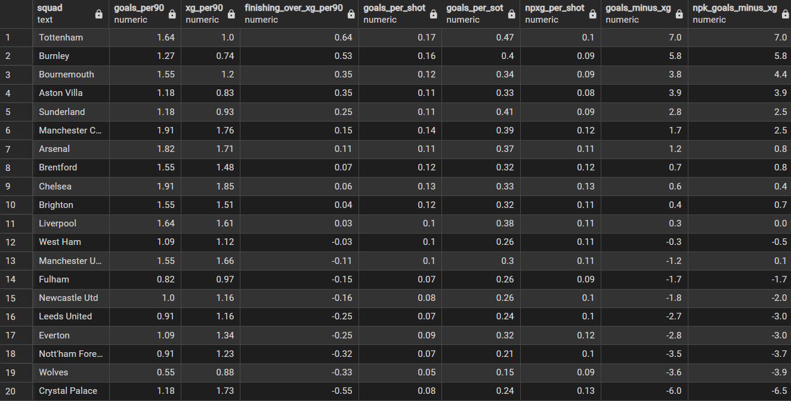
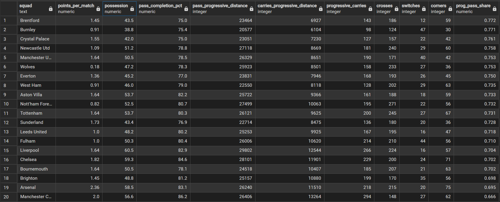

AS OF 11/17/25 (11 matches played)

1. xG Over/Under-Performance (rank difference)

This table shows each team's current performance in the league relative to their points per match and expected goal (xG) difference, ordered by the overperformance_rank_diff (rank_xg_diff - rank_points) coefficient.
Positive overperformance_rank_diff = Team performs better in the table than their xG suggests.
Negative overperformance_rank_diff = Team performs worse in the table than their xG suggests.

Astion Villa top the overperformance rankings, sitting 6th in the league despite an xG difference of -0.49 per 90 mins - the third-worst in the division just behind relegation contenders Wolves (-.058) and Burnley (-1.39). Their overperformance score of +13 indicates that their league position is significantly higher than their underlying numbers suggest. In a competitive league where variance plays a large role, such a large gap raises concerns about sustainability. However, Villa's recent form (WWWLW) shows resilience, suggesting that momentum - not underlying performance - maybe be a driving factor for their results.

Crystal Palace sit at the bottom of the overperformance table with -6, meaning they rank far lower than their xG metrics predict. Despite being 10th, they post a strong +0.58 xG difference per 90 mins - the fourth highest in the league - placing them statistically alongside league leaders Arsenal (1.16), Manchester City (0.82), and Chelsea (0.63). This suggests Palace have been unlucky rather than poor, especially with only one win in their last five matches (LDLWD). If their finishing and match management improve, their league position should converge upward toward their underlying performance.

2. Finishing Efficiency (clinical vs wasteful)

This table shows each team's finishing stats, ordered by the finishing_over_xg_per90 (goals_per90 - xg_per90) coefficient.
Positive finishing_over_xg_per90 = Team scores more goals than expected from xG
Negative finishing_over_xg_per90 = Team scores fewer goals than expected from xG

Tottenham lead the finishing efficiency rankings, scoring 0.64 more goals per 90 than expected, with a league-best +7.0 goals-minus-xG total. They also rank first in both goals per shot and goals per shot on target, highlighting exceptional shot quality conversion. Despite a negative xG difference (–0.38 per 90), Tottenham sit 5th in the league, suggesting that elite finishing is compensating for defensive weaknesses. Their form (WLWLD) reflects this volatility: when their finishing cools, their underlying issues become exposed.

Crystal Palace sit at the bottom of another table with 0.55 fewer goals than expected per 90 and a -6.0 goals-minus-xG total, indiciating consistently poor finishing efficiency. This finishing underperformance is strongly reflected in their negative overperformance score in the performance table. Interestingly, while their finishing is weak, Palace's underlying defensive metrics (including a toup-four xG difference per 90) suggest that they are structurally solid without the ball. If they can improve their ability to convert chances while maintaining their defensive level, they have significant upside and are strong candidates for positive regression in the coming matches.

 3. Defensive Solidity (goals vs xG allowed)

This table shows each team's defensive stats, ordered by the ga_vs_xga_per90 (xga_per90 - ga_per90) coefficient.
Positive ga_vs_xga_per90 = Team concedes fewer goals than expected from xG allowed
Negative ga_vs_xga_per90 = Team concedes more goals than expected from xG allowed

Tottenham top the defensive overperformance metric, conceding 0.473 fewer goals per 90 than expected. While this seems contradictory given their negative xG difference, the explanation is simple: Spurs concede higher-quality chances than they create, but they outperform both ends of the pitch through elite execution. They finish their chances far better than expected and concede far fewer goals than expected, indicating strong shot-stopping and clinical attacking. In short, Tottenham’s results are driven more by finishing efficiency and goalkeeping overperformance than by their underlying chance-quality process.

Wolves rank last with 0.82 more goals conceded per 90 than expected, reflecting both poor defensive execution and subpar goalkeeping. Combined with bottom-tier finishing, this explains their last-place standing and lack of a league win. Their metric suggest systemic issues on both ends of the pitch, and a significant tactical overhaul may be required to reverse their trajectory.

4. Team Style

This table shows each team's passing stats, ordered by the prog_pass_share (pass_progressive_distance / (pass_progressive_distance + carries_progressive_distance)) coefficient.
Higher prog_pass_share = Team relies more on progressive passes to move forward than progressive carries (direct/vertical progression)
Lower prog_pass_share = Team relies less on progressive passes to move forward than progressive carries (dribble/driven progression)

At the top of the table are Brentford (0.772), Burnley (0.771), and Crystal Palace (0.761). All three combine low pass completion and low possession, but generate a high share of forward movement through progressive passing. This indicates a vertical, direct style built around moving the ball forward quickly rather than sustaining long passing sequences. These teams frequently defend deep and transition forward rapidly, a common approach for sides outside the top tier.

At the opposite end are Manchester City (0.666), Arsenal (0.695), and Brighton (0.698), the only teams below a 0.70 share. This shows a greater reliance on progressive carries—advancing the ball through dribbling, player movement, and short interconnected passes. These teams are built for sustained possession and fluid buildup play, trusting their players to navigate pressure with close control.

Brighton’s numbers stand out: despite mid-table possession, they record one of the highest progressive carry distances in the league, explaining their lower progressive pass share.

A noteworthy trend emerges: 8 of the 10 teams with lower progressive passing reliance earn above-average points per match. While correlation does not imply causation, this suggests that teams who progress through carries - and therefore maintain more control between lines - may be rewarded with stronger overall performances.

Using crosses and switches as proxies for width, Nottingham Forest, Tottenham, Newcastle, Wolves, Liverpool and Arsenal emerge as the most cross-heavy, wide-attacking sides. Fulham, Manchester United, Brighton and especially Burnley rely strongly on diagonal switches to stretch the pitch, even when their cross volume is more modest. In contrast, teams like Brentford, Aston Villa, Sunderland and Crystal Palace generate relatively few crosses and switches, suggesting a narrower, more central approach or simple lack of sustained wide possession.